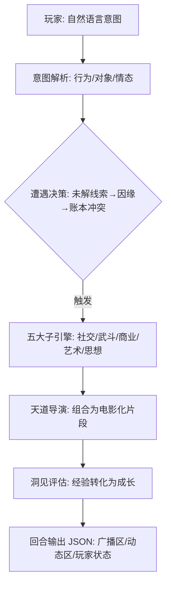
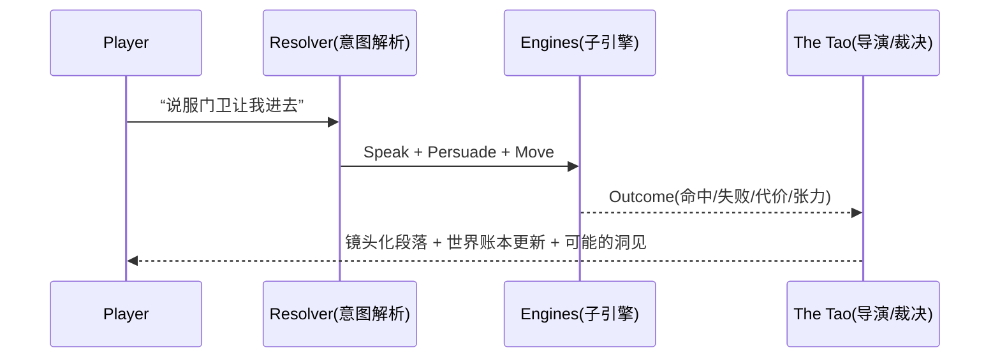

# Dreamheart: Urban Rhapsody

> **AI‑Native 开放世界叙事引擎 · “天道裁决，群体博弈，动态平衡”**

<p align="center">
  
  
  
  
</p>

<p align="center">
  <sub>本 README 聚焦“快速上手 + 一眼看懂”。展示的视觉元素均为示意（流程图、结构图、徽标等），非游戏内截图。</sub>
</p>

---

## 0) TL;DR — 一句话了解

**Dreamheart** 把 AI 设为“天道（The Tao）”，不是帮玩家通关，而是**裁决世界的平衡**。
玩家通过自然语言行动，驱动 **社交 / 武斗 / 商业 / 艺术 / 思想** 五大子引擎，
世界以“春秋笔法”的**电影化段落**回应；成长不靠刷级，而来自**洞见（Insight）**。

---

## 1) 核心卖点（Why it’s different）

* **AI = 天道，不站队**：以“平衡/因果/公正”约束世界；成功与失败都产生张力。
* **NPC 具主权**：重要 NPC 拥有价值观、目标与“维护档案”，与你平等博弈。
* **成长即洞见**：读懂世界、做出抉择，触发洞见与姿态解锁，而非数值堆叠。
* **统一原子行动**：一切输入被解析为标准化 Outcome，稳定且可回放/测试。

---

## 2) 三张图看懂系统

### 2.1 回合核心循环（Core Loop）



### 2.2 “天道”裁决视图（示意）



### 2.3 属性与对抗一览

* **五维心智（Psyche）**：`Cognition / Perception / Resolve / Taste / Aura`
* **心防（Composure）**：NPC 对非物理攻势的抗性（可被价值观命中削弱）
* **命中要诀**：

  * 命中心理驱动力（Drive）≈ 额外伤害与特效
  * 场域（区域 Buff/Debuff）会放大或抑制某些维度

---

## 3) 五分钟上手（Quickstart）

> 你可以把 Dreamheart 当作“对话式 RPG”。开局就能玩 —— 无需记指令集。

### 3.1 最快开始（Playtest 方法 A：对话/命令行）

1. **进入游戏会话**（本地或聊天窗口）。
2. **直接说你要做什么**：

   * *“推开门，环顾四周，压低声音问：‘楼上有易手的画吗？’”*
   * *“把名片递给‘秋池’，请求她引荐街对面画廊的策展人。”*
3. 系统会**解析意图**→ 触发子引擎 → **以电影化文本**反馈，并更新角色与世界。

### 3.2 精准表达的小技巧

* **目标 + 对象 + 情态**：

  * *“我想稳住场面（冷静），把话题岔到上周拍卖。”*
* **连续动作一句话说完**：

  * *“说完起身拉门离开，路过前台时把那张报纸顺手带走。”*
* **允许含糊**：

  * 不确定就说疑问句，系统会以观察/试探回应。

---

## 4) 你能做什么（Gameplay Surfaces）

* **社交对抗**（Persuade/Deceive/Intimidate/Charm）：攻“心防”，命中价值观触发特效。
* **武斗**（Strike/Disarm/Grapple/Break）：物理风险更高，可能触发“因果”惩罚链。
* **商业**（Bid/Arbitrate/Smuggle/Expose）：牵动信用、现金流与口碑。
* **艺术**（Curate/Perform/Appraise/Forge）：改变他人品味与城市“气场”。
* **思想**（Debate/Inspire/Subvert/Reveal）：撬动立场、意识形态与叙事锚点。

---

## 5) 角色与成长（Character & Growth）

* **角色卡（简版）**

  * `Psyche`：五维心智
  * `Stance`：当前姿态（如「冷静」「咄咄逼人」「含蓄」）
  * `Clarity / Vigor / Credit / Assets`
  * `Rapport`：与 NPC 的关系账本
* **洞见（Insight）**

  * 通过关键事件/失败的反思/角色共鸣获得
  * 可解锁新姿态、微特长，或小幅修正五维

---

## 6) 输入 / 输出范例（I/O）

### 6.1 玩家输入（例）

> “我把夹克口袋里的小册子递给保安，说‘我去楼上找秋池，她在等我’，然后继续往里走。”

### 6.2 回合输出（示意 JSON，精简）

```json
{
  "broadcast": [
    {"zone": "Lobby", "event": "保安抬手示意，打量你的口吻与神情。"}
  ],
  "dynamic_view": {
    "shots": [
      {"type": "closeup", "text": "你递出小册子，指腹触到纸边的冷意。"},
      {"type": "two-shot", "text": "保安犹疑：‘她真在等你？’"}
    ],
    "outcomes": [
      {"engine": "Social", "test": "Persuade vs Composure", "result": "mixed"}
    ]
  },
  "player_state": {
    "stance": "镇定",
    "insight_hint": "他对‘秋池’这个名字有反应。也许说对了。"
  }
}
```

> 开发者注：实际回合输出需符合项目的 I/O 规范（三分区：`broadcast / dynamic_view / player_state`）。

---

## 7) 内容分级与可选开关（Content & Safety）

* 本项目可出现**成人/暴力/黑市/政治隐喻**等成熟主题；请在设置中根据自己的接受度**切换开关**：

  * `Suggestive Themes` / `Violence` / `Crime` / `Substance` / `Political Satire`
* 关闭某项后，相关事件会被替换为等强度的其他张力来源。

---

## 8) 常见问题（FAQ）

**Q: 我不想被系统“评判”。**
A: 我们只“示现”——以镜头语言与后果呈现，不贴道德标签。

**Q: 会不会卡在无解局面？**
A: “天道”追求动态平衡。当局部闭环时，会引入新因缘/新开口。

**Q: 我能像指令式 RPG 那样下具体命令吗？**
A: 可以。自然语言会被自动拆解为标准行动并执行。

---

## 9) 面向开发者（Developer Notes）

* **模块化**：意图解析 → 原子行为 → 子引擎 → 导演裁决 → I/O 合成。
* **可测试性**：Outcome 结构稳定，易于做回归（对话 ≈ 数据管线）。
* **可扩展性**：新增子引擎/场域 Buff/价值观表，只需挂入决策与调度层。

---

## 10) 路线图（Roadmap）

* [ ] “因缘录”与 NPC 维护档案 UI 化（可视关系网络）
* [ ] 城市“场域”对五维的动态影响曲线（热区/冷区）
* [ ] 洞见图谱：从事件到认知改造的轨迹可视化
* [ ] 场景回放：任意回合的镜头化记录导出

---

## 11) 参与与反馈（Contribute）

* **玩家体验**：提交你最喜欢/最痛的 1 个瞬间 → 我们将用“春秋笔法”重构它
* **世界观/案情提案**：欢迎 PR（模板见 `/contrib/`）
* **Bug & 讨论**：开 Issue，附上 I/O 片段与复现步骤

---

<p align="center">🖤 愿你在 Dreamheart 的城市里，收集失败也收集勇气。</p>
